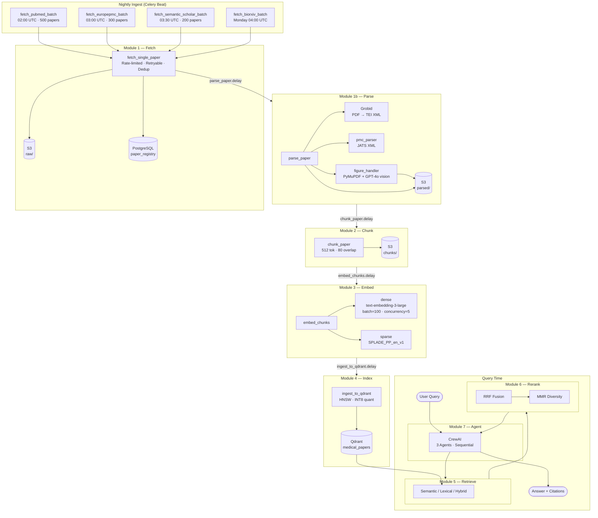

# RAG on Papers

Production-grade Retrieval-Augmented Generation system for medical research papers. Continuously ingests from PubMed, Europe PMC, Semantic Scholar, bioRxiv/medRxiv; parses PDFs and JATS XML; chunks, embeds (dense + sparse), and indexes into Qdrant; then serves hybrid search with a multi-agent CrewAI answer layer.

## Full Pipeline

## Module Summary

| Module | Entrypoint | Technology | Output |
|--------|-----------|-----------|--------|
| [1 — Fetch](modules/module1-fetch.md) | `fetch_*_batch` / `fetch_single_paper` | httpx, asyncio, RateLimiter | Raw PDF/XML on S3, registry row |
| [1b — Parse](modules/module1b-parse.md) | `parse_paper` | Grobid, PyMuPDF, OpenRouter GPT-4o | Structured JSON on S3 |
| [2 — Chunk](modules/module2-chunk.md) | `chunk_paper` | langchain-text-splitters, tiktoken | JSONL of chunks on S3 |
| [3 — Embed](modules/module3-embed.md) | `embed_chunks` | OpenRouter text-embedding-3-large, SPLADE_PP | Chunks with dense + sparse vectors |
| [4 — Index](modules/module4-index.md) | `ingest_to_qdrant` | Qdrant (HNSW + scalar quant) | Indexed points in Qdrant |
| [5 — Retrieve](modules/module5-retrieve.md) | `get_retriever(strategy)` | Qdrant semantic/lexical/hybrid | `RetrievalResult[]` |
| [6 — Rerank](modules/module6-rerank.md) | `rerank()` | RRF + MMR | Diverse top-k results |
| [7 — Agent](modules/module7-agent.md) | `run_query()` | CrewAI, OpenRouter GPT-4o | Final answer with citations |
| [8 — Eval](modules/module8-eval.md) | `run_ablation()` | RAGAS, MLflow | Metrics by strategy |

## Observability at a Glance

All metrics are exposed via Prometheus on **port 8000**. Logs are structured JSON via structlog. Traces are emitted via OpenTelemetry (optional OTLP export).

| Metric | Type | Labels |
|--------|------|--------|
| `papers_fetched_total` | Counter | `source` |
| `papers_parsed_total` | Counter | `status` |
| `chunks_indexed_total` | Counter | — |
| `embedding_latency_seconds` | Histogram | — |
| `retrieval_latency_seconds` | Histogram | `strategy` |
| `rerank_latency_seconds` | Histogram | — |
| `agent_run_latency_seconds` | Histogram | — |
| `figure_describe_latency_seconds` | Histogram | — |
| `openrouter_tokens_total` | Counter | `model`, `type` |
| `qdrant_points_total` | Gauge | — |
