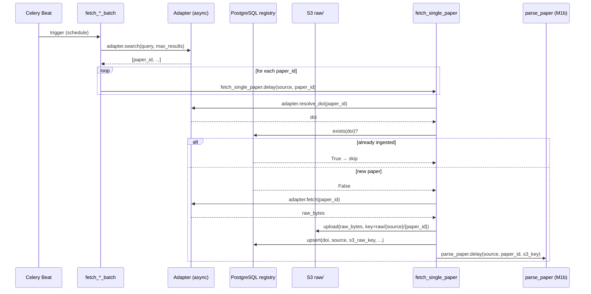
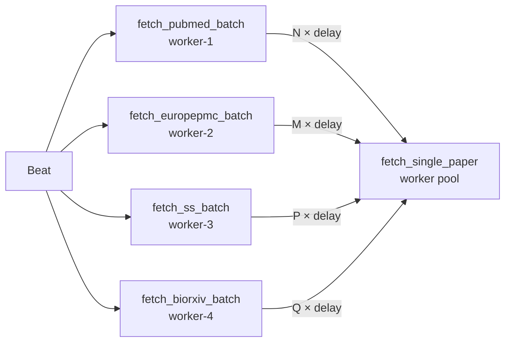

# Module 1 — Fetch

Discovers and downloads raw papers from four sources. Each source runs as a Celery Beat-scheduled batch task that fans out to per-paper `fetch_single_paper` tasks.

---

## Entrypoints

| Task | Schedule | `max_results` | `max_retries` |
|------|----------|--------------|---------------|
| `fetch_pubmed_batch(query, max_results=500)` | Daily 02:00 UTC | 500 | 3 |
| `fetch_europepmc_batch(query, max_results=300)` | Daily 03:00 UTC | 300 | 3 |
| `fetch_semantic_scholar_batch(query, max_results=200)` | Daily 03:30 UTC | 200 | 3 |
| `fetch_biorxiv_batch()` | Monday 04:00 UTC | — | 3 |
| `fetch_single_paper(source, paper_id)` | Fanned out by above | — | 5 |

All tasks are in `modules/module1_fetch/tasks.py`.

---

## Execution Flow



---

## Adapters

All adapters inherit from `BaseAdapter` and implement `search()`, `fetch()`, and `resolve_doi()`. Every outbound call goes through a **token-bucket `RateLimiter`** and a **Tenacity retry decorator**.

### Rate Limits

| Adapter | Rate (with key) | Rate (no key) |
|---------|----------------|---------------|
| PubMed | 10 req/s | 3 req/s |
| Semantic Scholar | 1 req/s | ~0.33 req/s |
| Europe PMC | — | polite crawl |
| bioRxiv | — | polite crawl |

### Retry Decorator (`make_retry()`)

```python
@tenacity.retry(
    stop=stop_after_attempt(5),
    wait=wait_exponential(multiplier=1, min=2, max=60),
    reraise=True,
)
```

### Adapter Specifics

=== "PubMed"
    - **Search**: NCBI ESEARCH → list of PMC IDs
    - **Fetch**: NCBI EFETCH returns full JATS XML (`rettype=xml`)
    - **DOI extraction**: `<article-id pub-id-type="doi">`

=== "Europe PMC"
    - **Search**: Europe PMC REST with pagination
    - **Fetch**: Prefers OA PDF URL; falls back to JSON record encoded as bytes
    - **DOI**: From metadata field

=== "Semantic Scholar"
    - **Search**: `/graph/v1/paper/search` with `fields=paperId,doi,title`
    - **Fetch**: Attempts direct PDF link; delegates to **Unpaywall** if none
    - **DOI**: From `/graph/v1/paper/{id}?fields=doi`

=== "bioRxiv / medRxiv"
    - **Search**: Returns last 7 days from `api.biorxiv.org` and `api.medrxiv.org`
    - **paper_id IS the DOI**: `https://www.biorxiv.org/content/{doi}.full.pdf`
    - **No separate resolve step**

=== "Unpaywall (fallback)"
    - Queried by Semantic Scholar adapter when no direct PDF
    - Endpoint: `https://api.unpaywall.org/v2/{doi}`
    - Extracts first `oa_locations[].url_for_pdf`

---

## Registry (`registry.py`)

Thin PostgreSQL access layer over `paper_registry` table.

| Function | SQL | Notes |
|----------|-----|-------|
| `exists(doi)` | `SELECT 1 WHERE doi=?` | Called before every fetch |
| `upsert(doi, ...)` | `INSERT … ON CONFLICT DO UPDATE` | Idempotent |
| `update(doi, ...)` | `UPDATE … WHERE doi=?` | Partial status update from downstream modules |

---

## Concurrency & Scaling



- Batch tasks themselves are lightweight fan-out loops; they run quickly.
- `fetch_single_paper` tasks are the actual work units — scale by adding Celery workers.
- Async HTTP inside each worker with per-source `asyncio.Semaphore` prevents simultaneous connection storms.
- `worker_prefetch_multiplier=1` ensures no worker hogs multiple long-running fetch tasks.

---

## Error Handling

| Scenario | Behaviour |
|----------|-----------|
| HTTP 4xx / 5xx | Tenacity retries up to 5× with exponential backoff (2–60 s) |
| `httpx.TimeoutException` | Auto-retried by Celery (`autoretry_for`) |
| Celery task failure after 5 retries | Task enters `FAILURE` state, logged, not re-queued |
| DOI already in registry | Skip silently — no fetch, no S3 write |
| Missing DOI | Fall back to `synthetic_key(title, first_author)` |
| Grobid/S3 errors downstream | Propagated back via task chain; `parse_paper` handles |

### Backoff Configuration (`fetch_single_paper`)

```python
autoretry_for=(httpx.HTTPError, httpx.TimeoutException)
retry_backoff=True        # exponential
retry_backoff_max=300     # cap at 5 minutes
retry_jitter=True         # ±random spread
max_retries=5
```

---

## Observability

| Signal | Detail |
|--------|--------|
| `papers_fetched_total{source=...}` | Incremented once per successful S3 upload |
| Log `paper_already_exists` | `{doi, source}` — skipped duplicates |
| Log `paper_fetched` | `{doi, source, s3_key}` — new paper stored |
| Log `pubmed_batch_dispatching` | `{query, count}` — batch fan-out start |
