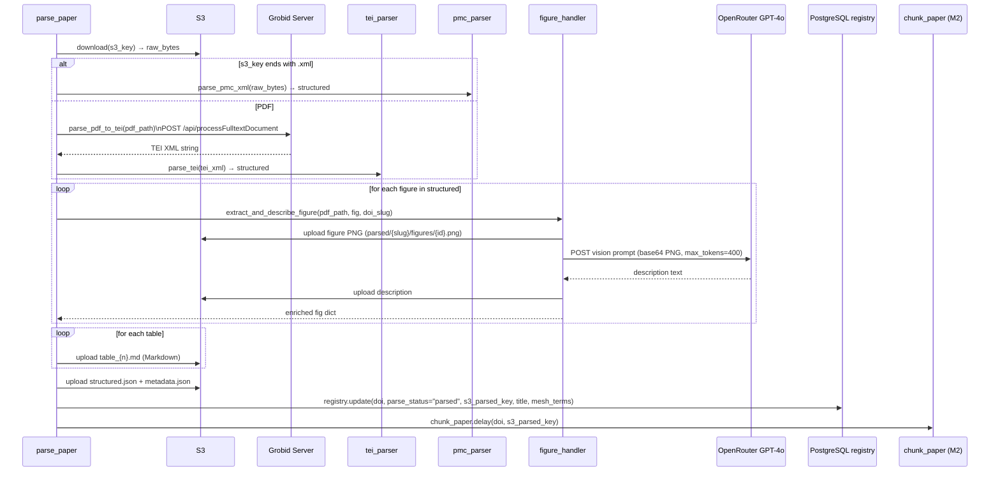
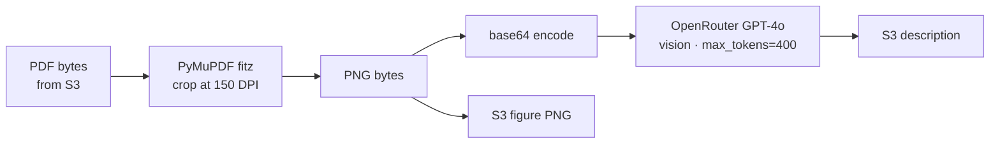

# Module 1b — Parse

Transforms raw PDF or JATS XML into a fully structured JSON document, extracts and AI-describes figures, and serialises tables to Markdown. Chains immediately into Module 2.

---

## Entrypoint

```python
parse_paper(source: str, paper_id: str, s3_key: str)
```

- **File**: `modules/module1b_parse/tasks.py`
- `max_retries=3`, `autoretry_for=(Exception,)`, `retry_backoff=True`

---

## Execution Flow



---

## Parsing Components

### Grobid Client (`grobid_client.py`)

Calls the Grobid Java service for PDF-to-TEI extraction.

```
POST {grobid_url}/api/processFulltextDocument
  params:
    generateIDs=1           # stable XML IDs for cross-refs
    consolidateHeader=1     # enrich metadata via Crossref
    teiCoordinates=figure   # bounding-box coords for figure crops
    segmentSentences=1      # sentence boundary markers
  timeout: 120 s
```

!!! warning "Grobid 503"
    When Grobid returns HTTP 503 (not ready / busy), `parse_pdf_to_tei` raises `RuntimeError`. Celery's `autoretry_for=(Exception,)` picks this up and retries with backoff.

`grobid_is_alive()` can be polled as a readiness check before starting workers.

### TEI Parser (`tei_parser.py`)

Parses Grobid's TEI XML output using `lxml` with the TEI namespace `http://www.tei-c.org/ns/1.0`.

| Field | XPath |
|-------|-------|
| DOI | `.//tei:idno[@type="DOI"]` |
| Title | `.//tei:titleStmt/tei:title[@type="main"]` |
| Abstract | `.//tei:abstract` |
| Authors | `.//tei:fileDesc//tei:author` (name + affiliation) |
| Journal | `.//tei:monogr/tei:title[@level="j"]` |
| Pub date | `.//tei:publicationStmt/tei:date[@type="published"]/@when` |
| Keywords | `.//tei:keywords/tei:term` |
| Sections | `.//tei:body/tei:div` (heading + text paragraphs) |
| Figures | `.//tei:figure` (caption, TEI coords `page,x,y,w,h`) |
| Tables | `.//tei:figure[@type="table"]` (caption + CALS/TEI cells) |

Figure coordinates string `"page,x,y,w,h"` is parsed into `{page, x, y, w, h}` for PyMuPDF cropping.

### PMC Parser (`pmc_parser.py`)

Parses PubMed Central JATS XML directly — no Grobid involved.

| Field | JATS Element |
|-------|-------------|
| DOI | `<article-id pub-id-type="doi">` |
| Title | `<title-group/article-title>` |
| Abstract | `<abstract>` (all `itertext()`) |
| Authors | `<contrib[@contrib-type="author"]>` + `xref[@ref-type="aff"]` |
| Pub date | `<pub-date>` with pub-type epub/ppub/collection |
| MeSH terms | `<MeshHeading/DescriptorName>` |
| Sections | `<body/sec>` (heading, para text, fig/table xrefs) |
| Figures | `<fig>` (no pixel coords; defaults to page=1, x=y=w=h=0) |
| Tables | `<table-wrap>` (caption + Markdown conversion) |

### Figure Handler (`figure_handler.py`)



The HTTP call to OpenRouter has a **60 s timeout** and no automatic retry (Celery task-level retry handles failures). Latency is observed in `figure_describe_latency_seconds`.

### Table Handler (`table_handler.py`)

Converts the parsed table (list of rows/cells) into GitHub-Flavored Markdown and uploads to `parsed/{doi_slug}/tables/table_{n}.md`.

---

## Structured Output Schema

```json
{
  "doi": "10.1234/example",
  "title": "...",
  "authors": [{"name": "Jane Smith", "affiliation": "Harvard"}],
  "journal": "NEJM",
  "pub_date": "2023-06-15",
  "mesh_terms": ["Metformin", "Diabetes Mellitus, Type 2"],
  "keywords": ["HbA1c", "glycemic control"],
  "abstract": "...",
  "sections": [
    {
      "heading": "Methods",
      "text": "...",
      "figure_refs": ["fig1"],
      "table_refs": ["tbl1"]
    }
  ],
  "figures": [
    {
      "fig_id": "fig1",
      "caption": "Kaplan-Meier curve...",
      "coords": {"page": 3, "x": 72, "y": 200, "w": 468, "h": 300},
      "s3_img_key": "parsed/10-1234-example/figures/fig1.png",
      "description": "The figure shows a Kaplan-Meier..."
    }
  ],
  "tables": [
    {"table_id": "tbl1", "caption": "Baseline characteristics", "markdown": "| ... |"}
  ]
}
```

---

## Concurrency & Scaling

- **One Celery worker per `parse_paper` task** — these are long-running (Grobid can take 30–90 s per paper).
- Figure description calls are **sequential within a task** (one OpenRouter request per figure). Papers with many figures are the bottleneck; consider running multiple `parse_paper` workers.
- Grobid itself supports concurrent requests — deploy Grobid behind a load balancer or with multiple instances for higher throughput.
- `worker_prefetch_multiplier=1` prevents a single worker from accumulating a queue of parse tasks while others are idle.

---

## Error Handling

| Scenario | Behaviour |
|----------|-----------|
| Grobid 503 | `RuntimeError` raised → Celery retries (backoff) |
| Grobid timeout (>120 s) | `httpx.TimeoutException` → Celery retries |
| Figure crop fails | Logged, figure skipped (description set to empty string) |
| OpenRouter vision failure | Task exception → Celery retry |
| XML parse error (malformed) | Exception propagates → Celery retry or `FAILURE` |
| S3 upload error | Exception propagates → Celery retry |
| Any unhandled exception | `autoretry_for=(Exception,)`, max 3 retries with backoff |

---

## Observability

| Signal | Detail |
|--------|--------|
| `papers_parsed_total{status="success"}` | Incremented after successful structured JSON upload |
| `figure_describe_latency_seconds` | Histogram observation per figure |
| Log `grobid_parsed` | `{pdf_path, bytes}` — after successful TEI extraction |
| Log `paper_parsed` | `{doi, s3_key}` — task completion |
