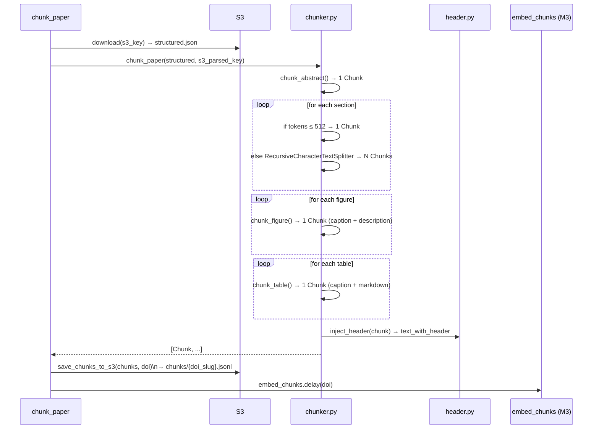

# Module 2 — Chunk

Splits the structured document JSON into fixed-size, overlapping text chunks with injected bibliographic headers. Each chunk is a `Chunk` Pydantic object persisted as JSONL on S3.

---

## Entrypoint

```python
chunk_paper(doi: str, s3_key: str)
```

- **File**: `modules/module2_chunk/tasks.py`
- `max_retries=3`, `autoretry_for=(Exception,)`, `retry_backoff=True`

---

## Execution Flow



---

## Chunking Strategy

### Parameters

| Setting | Value |
|---------|-------|
| Tokeniser | `cl100k_base` (OpenAI tiktoken) |
| Chunk size | `512` tokens |
| Chunk overlap | `80` tokens |
| Splitter | `RecursiveCharacterTextSplitter` |
| Separators | `["\n\n", "\n", ". ", " ", ""]` |

### Element Types

| `element_type` | Source | Size |
|---------------|--------|------|
| `abstract` | `structured["abstract"]` | Always single chunk |
| `section` | `structured["sections"][n]["text"]` | Split if > 512 tok |
| `figure` | `fig["caption"] + "\n\n" + fig["description"]` | Always single chunk |
| `table` | `tbl["caption"] + "\n\n" + tbl["markdown"]` | Always single chunk |

Sections longer than 512 tokens produce multiple chunks with `sub_index` counting from 0. The `chunk_index` field provides the global position across all chunks of a document.

### Header Injection (`header.py`)

Every chunk's `text_with_header` field prepends:

```
Paper: {title}
Journal: {journal}  |  Date: {pub_date}
Section: {section_heading}
---
{chunk.text}
```

This is the string actually passed to the embedding model, giving it bibliographic context without polluting the raw `text` field used for display and citation.

---

## Chunk Identity

Each `Chunk` gets:

- `chunk_id`: `uuid4()` — globally unique, used as Qdrant point ID
- `doi_slug`: `doi_to_slug(doi)` — used in S3 key construction

---

## Persistence

Chunks are written as **newline-delimited JSON** (one object per line) to:

```
s3://bucket/chunks/{doi_slug}.jsonl
```

`load_chunks_from_s3(doi)` reverses this — deserialises each line back to a `Chunk` model.

---

## Concurrency & Scaling

- Chunking is **CPU-bound** and fast (< 1 s for most papers).
- The bottleneck is the parse step upstream. Chunk tasks clear quickly.
- No internal concurrency — single-threaded chunker per task.
- Scale by adding Celery workers if the queue builds up (unlikely given task speed).

---

## Error Handling

| Scenario | Behaviour |
|----------|-----------|
| S3 download fails | Exception → Celery retry (max 3, backoff) |
| Malformed structured JSON | `ValidationError` → Celery retry |
| Empty abstract / sections | Skipped silently; figure/table chunks still created |
| S3 upload fails | Exception → Celery retry |

---

## Observability

| Signal | Detail |
|--------|--------|
| Log `paper_chunked` | `{doi, chunk_count, s3_key}` — after JSONL upload |
