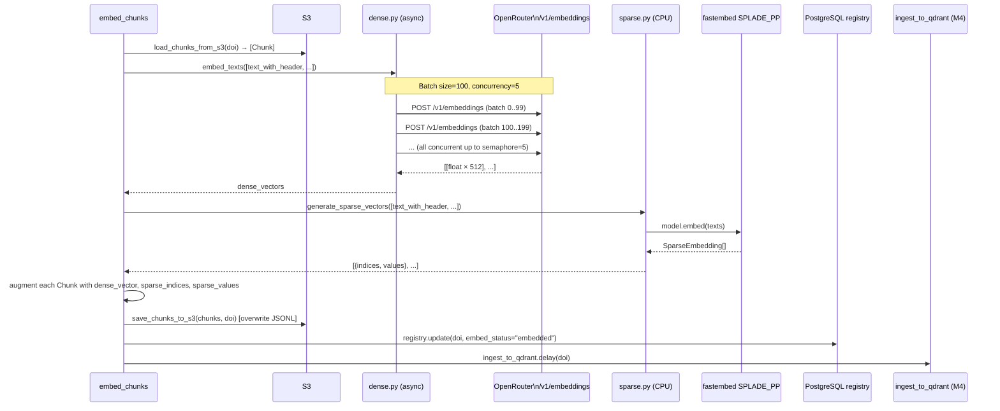
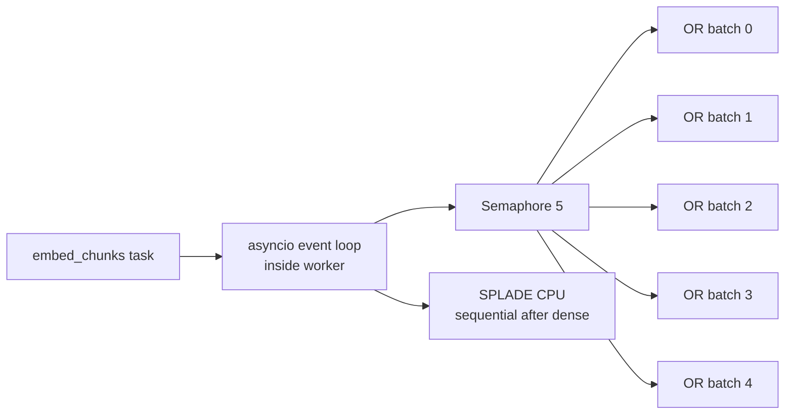

# Module 3 — Embed

Generates dense (OpenRouter `text-embedding-3-large`) and sparse (SPLADE_PP) vectors for every chunk, then re-uploads the augmented JSONL and chains to Module 4.

---

## Entrypoint

```python
embed_chunks(doi: str)
```

- **File**: `modules/module3_embed/tasks.py`
- `max_retries=3`

---

## Execution Flow



---

## Dense Embedding (`dense.py`)

### Model

| Setting | Value |
|---------|-------|
| Provider | OpenRouter → OpenAI |
| Model ID | `openai/text-embedding-3-large` |
| Dimensions | `512` (via `dimensions` param) |
| Input | `chunk.text_with_header` (header-injected text) |

### Batching & Concurrency

```python
BATCH_SIZE = 100          # texts per API request
semaphore = asyncio.Semaphore(5)  # max 5 concurrent batches
```

`embed_texts()` is `async`. It creates all batch coroutines and runs them with `asyncio.gather` gated by the semaphore. With 200 chunks this means 2 concurrent requests; with 1 000 chunks, 5 run at a time.

### Retry

Each `_embed_batch()` call is wrapped with Tenacity:

```python
@tenacity.retry(
    stop=stop_after_attempt(5),
    wait=wait_exponential(multiplier=1, min=2, max=60),
    retry=retry_if_exception_type(httpx.HTTPError),
)
```

### Token Tracking

After each batch, `openrouter_tokens_total{model, type="total"}` is incremented from the `usage.total_tokens` field in the API response.

---

## Sparse Embedding (`sparse.py`)

### Model

| Setting | Value |
|---------|-------|
| Library | `fastembed` |
| Model | `prithivida/Splade_PP_en_v1` |
| Cache | `~/.cache/fastembed` (~500 MB download on first run) |
| Hardware | CPU only |

### Implementation

```python
@lru_cache(maxsize=1)
def _load_model() -> SparseTextEmbedding:
    return SparseTextEmbedding(model_name="prithivida/Splade_PP_en_v1")

def generate_sparse_vectors(texts: list[str]) -> list[dict]:
    model = _load_model()
    return [
        {"indices": emb.indices.tolist(), "values": emb.values.tolist()}
        for emb in model.embed(texts)
    ]
```

The model is loaded **once per worker process** via `lru_cache` — subsequent calls reuse the same in-memory model.

!!! note "Memory"
    SPLADE_PP loads ~500 MB into RAM. Workers running embed tasks need at least 1.5 GB free.

---

## Concurrency & Scaling



- Dense embedding is **I/O-bound** — concurrency of 5 batches maximises OpenRouter throughput.
- Sparse embedding is **CPU-bound** — runs sequentially after dense embedding completes.
- The overall task runs inside `asyncio.run()` (invoked by the synchronous Celery wrapper).
- To scale throughput, add more Celery workers — each runs its own event loop and SPLADE model instance.

---

## Error Handling

| Scenario | Behaviour |
|----------|-----------|
| OpenRouter HTTP error | Tenacity retries up to 5× per batch |
| Tenacity exhausted | Exception propagates → Celery retry (max 3) |
| SPLADE model load fails | Exception → Celery retry |
| S3 upload fails | Exception → Celery retry |

---

## Observability

| Signal | Detail |
|--------|--------|
| `embedding_latency_seconds` | Histogram — total wall time for all batches |
| `openrouter_tokens_total{model, type="total"}` | Accumulated from each batch response |
