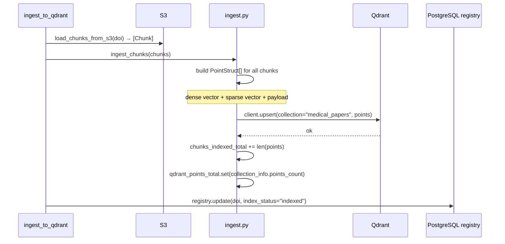

# Module 4 — Index

Loads the vector-augmented chunks from S3 and upserts them into Qdrant as structured points with both dense and sparse vectors and full payload metadata.

---

## Entrypoint

```python
ingest_to_qdrant(doi: str)
```

- **File**: `modules/module4_index/tasks.py`
- `max_retries=3`, `autoretry_for=(Exception,)`, `retry_backoff=True`

---

## Execution Flow



---

## Qdrant Collection (`setup.py`)

### Schema

The collection `medical_papers` is created once via `create_collection()`:

```python
VectorsConfig({
    "dense": VectorParams(
        size=512,
        distance=Distance.COSINE,
        hnsw_config=HnswConfigDiff(m=16, ef_construct=200, full_scan_threshold=10_000),
        quantization_config=ScalarQuantization(
            scalar=ScalarQuantizationConfig(type=ScalarType.INT8, quantile=0.99, always_ram=True)
        ),
    )
})
sparse_vectors_config={"sparse": SparseVectorParams()}
```

| Setting | Value | Purpose |
|---------|-------|---------|
| Distance | Cosine | Normalised similarity for embeddings |
| HNSW `m` | 16 | Graph connectivity — higher = better recall, more RAM |
| HNSW `ef_construct` | 200 | Build-time candidates — higher = better index quality |
| `full_scan_threshold` | 10 000 | Switch to brute-force below this point count |
| Quantisation | INT8 scalar, quantile=0.99 | ~4× memory reduction with minimal recall loss |
| `always_ram=True` | — | Keep quantised vectors in RAM for fast ANN |

### Payload Indexes

All filterable fields are indexed for efficient pre-filtering:

| Field | Index type |
|-------|-----------|
| `doi` | KEYWORD |
| `pub_year` | INTEGER |
| `pub_date` | KEYWORD |
| `element_type` | KEYWORD |
| `mesh_terms` | KEYWORD |
| `journal` | KEYWORD |
| `source_db` | KEYWORD |
| `has_figure` | KEYWORD (bool) |
| `has_table` | KEYWORD (bool) |

### Utility Functions

| Function | Purpose |
|----------|---------|
| `get_client()` | Create `QdrantClient(url, api_key)` |
| `create_collection()` | One-time setup |
| `delete_collection()` | Full teardown |
| `delete_paper(doi)` | Filter-delete all points for a DOI |
| `fetch_vectors_from_qdrant(ids)` | Retrieve dense vectors by point ID (for MMR reranking) |

---

## Point Structure (`ingest.py`)

Each `Chunk` becomes one Qdrant `PointStruct`:

```python
PointStruct(
    id=str(chunk.chunk_id),       # UUID string
    vector={
        "dense": chunk.dense_vector,
        "sparse": SparseVector(
            indices=chunk.sparse_indices,
            values=chunk.sparse_values,
        ),
    },
    payload={
        "doi": chunk.doi,
        "title": chunk.title,
        "authors": chunk.authors,
        "journal": chunk.journal,
        "pub_date": chunk.pub_date,
        "pub_year": chunk.pub_year,
        "source_db": chunk.source_db,
        "section_heading": chunk.section_heading,
        "chunk_index": chunk.chunk_index,
        "element_type": chunk.element_type,
        "mesh_terms": chunk.mesh_terms,
        "keywords": chunk.keywords,
        "text": chunk.text,
        "s3_parsed_key": chunk.s3_parsed_key,
        "has_figure": chunk.has_figure,
        "has_table": chunk.has_table,
    },
)
```

All chunks for a DOI are upserted in a **single `client.upsert()` call** — Qdrant batches internally.

---

## Concurrency & Scaling

- One Celery task per DOI; the upsert is a single synchronous Qdrant call.
- Qdrant handles concurrent upserts from multiple workers — it is safe to run many `ingest_to_qdrant` tasks simultaneously.
- For high-volume ingestion, increase the number of workers dedicated to module-4 tasks (separate queue if needed).
- Qdrant's HNSW index builds incrementally — search quality is maintained during concurrent writes.

---

## Error Handling

| Scenario | Behaviour |
|----------|-----------|
| Chunk missing vectors | Logged warning; chunk skipped (not upserted) |
| Qdrant connection failure | Exception → Celery retry (max 3, backoff) |
| S3 load fails | Exception → Celery retry |
| Upsert partial failure | Qdrant is idempotent — same `chunk_id` re-upserts cleanly |

---

## Observability

| Signal | Detail |
|--------|--------|
| `chunks_indexed_total` | Incremented by `len(points)` per successful upsert |
| `qdrant_points_total` | Gauge set to `collection_info.points_count` after each upsert |
| Log `chunks_ingested` | `{doi, count}` — task completion |
| Log `paper_deleted_from_qdrant` | `{doi}` — when `delete_paper()` is called |
