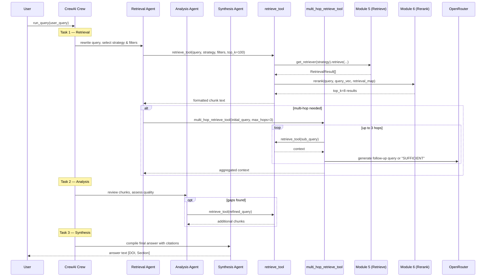

# Module 7 — Agent

Orchestrates a three-agent CrewAI crew that rewrites queries, retrieves and analyses evidence, then synthesises a cited answer. Supports single-hop and iterative multi-hop retrieval.

---

## Entrypoint

```python
from modules.module7_agent.crew import run_query

answer: str = run_query(user_query="What is the effect of metformin on HbA1c?")
```

**File**: `modules/module7_agent/crew.py`

No Celery task — called synchronously (or via an API layer not included in this repo).

---

## Execution Flow



---

## Agents (`crew.py`)

### LLM Configuration

All agents share the same LLM:

```python
llm = LLM(
    model="openai/gpt-4o",
    base_url="https://openrouter.ai/api/v1",
    api_key=settings.openrouter_api_key,
)
```

### Agent Definitions

=== "Retrieval Agent"
    - **Role**: Medical Research Retrieval Specialist
    - **Tools**: `retrieve_tool`, `multi_hop_retrieve_tool`
    - **`max_iter`**: 5
    - **Goal**: Rewrite the user query for retrieval, select the optimal strategy and filters, and fetch high-quality evidence chunks.

=== "Analysis Agent"
    - **Role**: Medical Evidence Analyst
    - **Tools**: `retrieve_tool`
    - **`max_iter`**: 3
    - **Goal**: Review retrieved chunks for relevance and quality; issue additional retrieval calls to fill gaps.

=== "Synthesis Agent"
    - **Role**: Medical Research Synthesiser
    - **Tools**: (none)
    - **`max_iter`**: — (single pass)
    - **Goal**: Compile the final answer with inline citations in the form `[DOI, Section]`.

### Task Chain

```python
crew = Crew(
    agents=[retrieval_agent, analysis_agent, synthesis_agent],
    tasks=[retrieval_task, analysis_task, synthesis_task],
    process=Process.sequential,
    verbose=True,
)
result = crew.kickoff()
```

Tasks run **sequentially** — each task receives the output of the previous as context.

---

## Tools (`tools.py`)

### `retrieve_tool`

```python
@tool
def retrieve_tool(
    query: str,
    strategy: str = "hybrid",    # "semantic" | "lexical" | "hybrid"
    mesh_terms: list[str] = [],
    year_from: int | None = None,
    element_type: str | None = None,
    top_k: int = 100,
) -> str:
```

**Steps**:

1. `build_filter(...)` — construct Qdrant filter
2. `get_retriever(strategy).retrieve(query, top_k, filters)` — fetch candidates
3. `embed_texts([query])` — get query dense vector
4. `rerank(query, query_vec, {"strategy": results})` — RRF + MMR → 8 results
5. `format_chunks_for_agent(results)` — return formatted string

**Output format**:

```
[1] 10.1234/nejm.abc  |  Methods  |  score: 0.873
Metformin reduced HbA1c by 1.2% vs placebo (p<0.001)...

[2] 10.5678/jama.xyz  |  Abstract  |  score: 0.841
...
```

### `multi_hop_retrieve_tool`

```python
@tool
def multi_hop_retrieve_tool(
    initial_query: str,
    max_hops: int = 3,
) -> str:
```

Iterative retrieval loop:

1. Call `retrieve_tool(initial_query)` → context
2. POST to OpenRouter: given `original_query` + `context`, output next query or `"SUFFICIENT"`
3. If `"SUFFICIENT"` → stop; else call `retrieve_tool(follow_up_query)` and accumulate context
4. Repeat up to `max_hops`

Each hop's context is appended; the aggregated string is returned to the agent.

### `_generate_followup_query`

```python
POST https://openrouter.ai/api/v1/chat/completions
model = "openai/gpt-4o"
system = "Generate a follow-up retrieval query or respond SUFFICIENT."
```

---

## Concurrency & Scaling

- **Sequential within a query**: Task 1 → Task 2 → Task 3, no parallelism.
- **Multi-hop is iterative**: up to 3 serial LLM + retrieval round-trips.
- **No shared state** between queries — each `run_query()` call creates an isolated crew execution.
- To handle concurrent user queries, run multiple API server instances. Each instance has its own event loop.
- LLM calls go through OpenRouter — rate limits and latency are the primary scaling constraint.
- `verbose=True` produces detailed step-by-step logs from CrewAI; disable in production for cleaner logs.

---

## Error Handling

| Scenario | Behaviour |
|----------|-----------|
| Retrieval returns empty | Agent falls back to `multi_hop_retrieve_tool` or reports no evidence found |
| OpenRouter rate limit (429) | CrewAI / httpx raises exception; caller should retry |
| `max_iter` reached | Agent stops, returns best answer so far |
| Multi-hop never hits "SUFFICIENT" | Stops at `max_hops=3`, returns accumulated context |
| Tool exception | CrewAI catches and reports to the agent as tool failure; agent may retry |

---

## Observability

| Signal | Detail |
|--------|--------|
| `agent_run_latency_seconds` | Histogram — full `crew.kickoff()` wall time |
| `openrouter_tokens_total` | Accumulated from each LLM call (via dense embedding and tool calls) |
| Log `crew_completed` | `{query, latency}` |
| CrewAI `verbose=True` | Step-by-step agent reasoning and tool calls to stdout/structlog |
