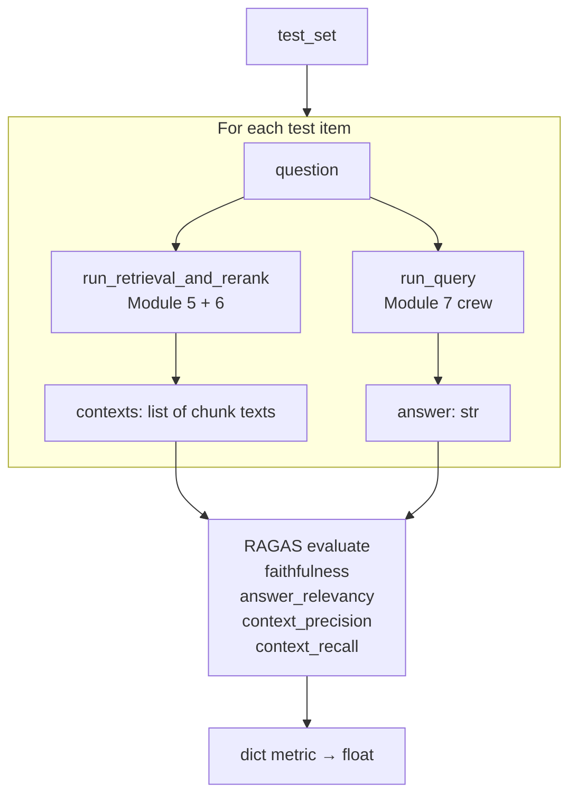
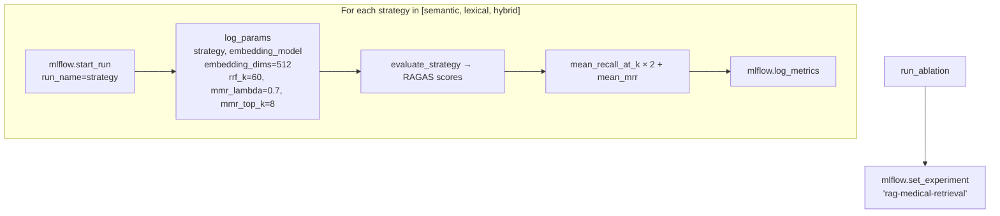

# Module 8 — Eval

Evaluates retrieval and answer quality across strategies using RAGAS metrics and ranking metrics, with all runs logged to MLflow.

---

## Components

| File | Purpose |
|------|---------|
| `ragas_eval.py` | End-to-end RAGAS evaluation per strategy |
| `retrieval_metrics.py` | Ranking metrics (Recall@k, MRR) + retrieval runner |
| `ablation.py` | MLflow ablation study across all strategies |

No Celery tasks — all eval functions are called directly from scripts or notebooks.

---

## RAGAS Evaluation (`ragas_eval.py`)

### Entrypoint

```python
scores: dict[str, float] = evaluate_strategy(
    test_set=[
        {
            "question": "What is the effect of metformin on HbA1c?",
            "ground_truth": "Metformin reduces HbA1c by approximately 1–1.5%.",
        },
        ...
    ],
    strategy="hybrid",   # "semantic" | "lexical" | "hybrid"
)
```

### Flow



### RAGAS Metrics

| Metric | Measures |
|--------|---------|
| `faithfulness` | Is the answer factually grounded in the retrieved context? |
| `answer_relevancy` | Does the answer address the question? |
| `context_precision` | Are the retrieved chunks relevant to the question? |
| `context_recall` | Does the context cover the ground truth? |

RAGAS constructs a `Dataset` from `{question, answer, contexts, ground_truth}` rows and returns a score dict with values in [0, 1].

---

## Retrieval Metrics (`retrieval_metrics.py`)

### Retrieval Runner

```python
results: list[RetrievalResult] = run_retrieval_and_rerank(
    query="metformin HbA1c",
    strategy="hybrid",
)
```

Internally: `get_retriever(strategy).retrieve(top_k=100)` → `embed_texts([query])` → `rerank(...)` → top-k results.

### Ranking Metrics

=== "Recall@k"
    ```python
    def recall_at_k(
        retrieved: list[RetrievalResult],
        relevant_dois: list[str],
        k: int,
    ) -> float:
    ```
    Fraction of `relevant_dois` appearing in the top-`k` retrieved chunks.

    $$\text{Recall}@k = \frac{|\text{relevant} \cap \text{top-}k|}{|\text{relevant}|}$$

=== "Mean Reciprocal Rank"
    ```python
    def mean_reciprocal_rank(
        retrieved: list[RetrievalResult],
        relevant_dois: list[str],
    ) -> float:
    ```
    Reciprocal of the rank of the first relevant result. 0 if none found.

    $$\text{MRR} = \frac{1}{1 + \text{rank\_of\_first\_relevant}}$$

=== "Mean Recall@k"
    ```python
    def mean_recall_at_k(test_set, strategy, k) -> float:
    ```
    Average `recall_at_k` over all queries in `test_set`.

=== "Mean MRR"
    ```python
    def mean_mrr(test_set, strategy) -> float:
    ```
    Average MRR over all queries in `test_set`.

---

## Ablation Study (`ablation.py`)

### Entrypoint

```python
run_ablation(test_set)
```

Runs the full evaluation for all three strategies and logs everything to MLflow.

### Flow



### MLflow Parameters Logged

| Parameter | Value |
|-----------|-------|
| `strategy` | `semantic \| lexical \| hybrid` |
| `embedding_model` | `openai/text-embedding-3-large` |
| `embedding_dims` | `512` |
| `rrf_k` | `60` |
| `mmr_lambda` | `0.7` |
| `mmr_top_k` | `8` |

### MLflow Metrics Logged

| Metric | Source |
|--------|--------|
| `faithfulness` | RAGAS |
| `answer_relevancy` | RAGAS |
| `context_precision` | RAGAS |
| `context_recall` | RAGAS |
| `recall_at_10` | ranking metrics |
| `recall_at_100` | ranking metrics |
| `mrr` | ranking metrics |

All three strategy runs are nested under the same `rag-medical-retrieval` experiment, enabling side-by-side comparison in the MLflow UI.

---

## Test Set Format (`eval/eval_set.jsonl`)

```json
{"question": "...", "ground_truth": "...", "relevant_dois": ["10.1234/...", "10.5678/..."]}
```

`relevant_dois` is used by `recall_at_k` and `mean_reciprocal_rank`. `ground_truth` is used by RAGAS `context_recall`.

---

## Concurrency & Scaling

- Each `evaluate_strategy()` call is sequential over the test set — one query at a time.
- RAGAS evaluation can be parallelised at the test-set level by sharding and running separate processes.
- `run_ablation` runs strategies sequentially; could be parallelised by running three separate processes and logging to the same MLflow experiment.
- MLflow tracking server can be local (`mlfile:./mlruns`) or remote (configured via `settings.mlflow_tracking_uri`).

---

## Error Handling

| Scenario | Behaviour |
|----------|-----------|
| Retrieval returns empty for a query | RAGAS context metrics score 0; logged as-is |
| OpenRouter failure during RAGAS | Exception propagates; run aborted |
| MLflow server unreachable | `mlflow.start_run()` raises; eval loop aborted |
